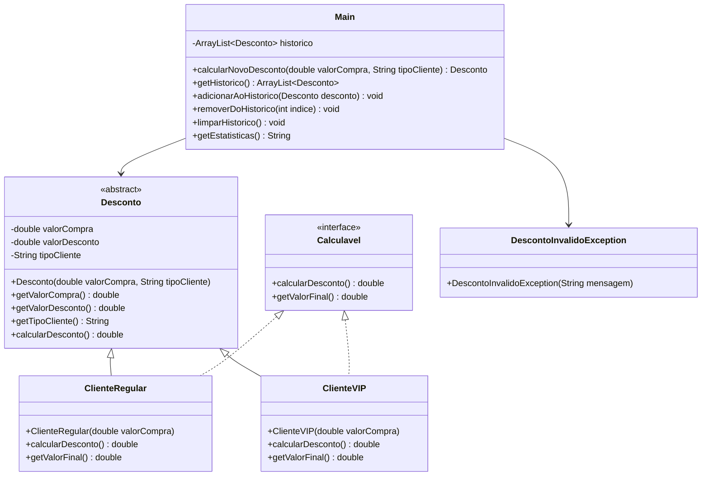

# calculadoraDescontos

Calculadora que calcula e armazena descontos com base na entrada de dados do tipo de cliente inserido (VIP ou REGULAR).

Projeto ETB A3 2° Semestre - Linguagem Técnica de Programação [Java]
Projeto orientado pelo professor Matheus Rosa, @profmatheusrosa

Funcionalidades
Estrutura de Classes:

Classe abstrata Desconto com atributos e métodos comuns (valorCompra, desconto, tipoCliente)
Subclasses para diferentes tipos de cliente (Regular, VIP), cada uma com regras de desconto específicas
Interface Calculavel com métodos para calcular desconto
Sobrecarga de métodos para cálculo do desconto
Uso de ArrayList<Desconto> para armazenar o histórico
Utilização dos principais métodos do ArrayList: add, remove, get, size, clear, contains, etc.
Exceções personalizadas para validação de valores (ex: DescontoInvalidoException)
Tratamento de exceções com try-catch e lançamento de exceções personalizadas
Entrada de Dados:

Valor da compra
Tipo de cliente (Regular/VIP)
Validar os dados lançando exceções personalizadas em caso de valores inválidos
Criar objeto correspondente e adicionar ao ArrayList de histórico
Processamento:

Calcular valor do desconto e valor final usando métodos das classes
Armazenar no histórico
Exibição:

Mostrar resultado atual
Exibir histórico de descontos (objetos)
Apresentar estatísticas
Permitir remoção de descontos do histórico
Permitir limpar todo o histórico usando clear()
Tratamento de Exceções:

Utilizar blocos try-catch para capturar exceções de entrada e de lógica
Lançar exceções personalizadas para valores inválidos

Exibir mensagens de erro amigáveis ao usuário

## Exemplo de Uso
```
=== CALCULADORA DE DESCONTOS 3.0 ===
1. Calcular desconto
2. Ver histórico
3. Remover desconto
4. Limpar histórico
5. Ver estatísticas
6. Sair
Escolha uma opção: 1

[NOVA COMPRA]
Valor da compra: -100.00
Erro: Valor da compra inválido!
Valor da compra: 100.00
Tipo de cliente (R/V): V

[RESULTADO]
Valor original: R$ 100.00
Desconto (10%): R$ 10.00
Valor final: R$ 90.00

=== CALCULADORA DE DESCONTOS 3.0 ===
1. Calcular desconto
2. Ver histórico
3. Remover desconto
4. Limpar histórico
5. Ver estatísticas
6. Sair
Escolha uma opção: 2

[HISTÓRICO]
1. R$ 10.00 (VIP)
2. R$ 25.00 (Regular)
3. R$ 150.00 (VIP)

=== CALCULADORA DE DESCONTOS 3.0 ===
1. Calcular desconto
2. Ver histórico
3. Remover desconto
4. Limpar histórico
5. Ver estatísticas
6. Sair
Escolha uma opção: 3

Digite o índice do desconto para remover: 2
Desconto removido com sucesso!

=== CALCULADORA DE DESCONTOS 3.0 ===
1. Calcular desconto
2. Ver histórico
3. Remover desconto
4. Limpar histórico
5. Ver estatísticas
6. Sair
Escolha uma opção: 4

Histórico limpo!

=== CALCULADORA DE DESCONTOS 3.0 ===
1. Calcular desconto
2. Ver histórico
3. Remover desconto
4. Limpar histórico
5. Ver estatísticas
6. Sair
Escolha uma opção: 5

[ESTATÍSTICAS]
Total descontos: R$ 185.00
Maior desconto: R$ 150.00
Menor desconto: R$ 10.00
Média: R$ 61.67

=== CALCULADORA DE DESCONTOS 3.0 ===
1. Calcular desconto
2. Ver histórico
3. Remover desconto
4. Limpar histórico
5. Ver estatísticas
6. Sair
Escolha uma opção: 6
Programa finalizado!
```

## Diagrama UML

